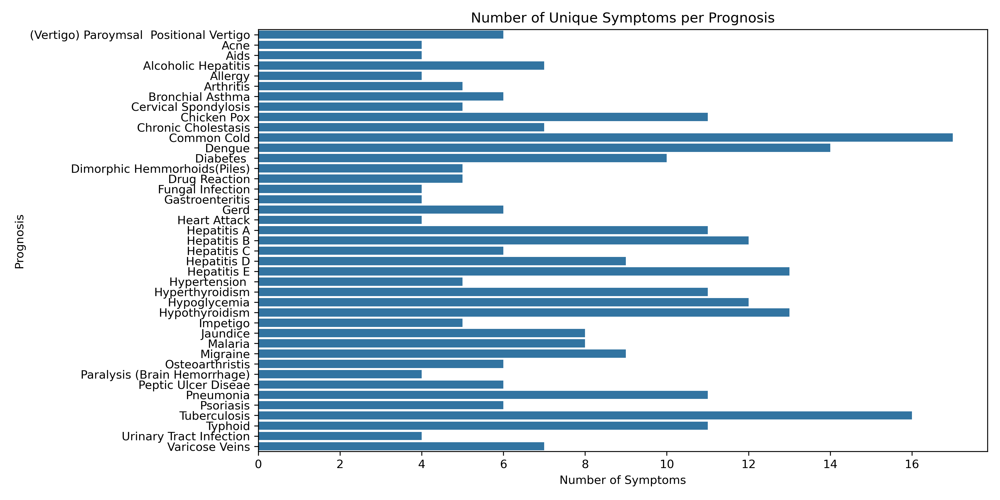

# Disease Prediction Using Machine Learning
## Table of Contents 
- Executive Summary 
- Problem Statement
- Project Goals 
- Methodology 
- Exploratory Analysis
    - Symptom Distribution 

## Executive Summary
This project serves as the final unit of the University of Toronto DSI Machine Learning Certificate Diploma. All contributors are visible within the repository. 

Our project leverages [this Kaggle dataset](https://www.kaggle.com/datasets/kaushil268/disease-prediction-using-machine-learning) to implement machine learning solutions aimed at clustering patients based on their symptoms, as well as determining symptoms that are the most important predictors for disease diagnosis.

## Problem Statement
Healthcare providers often struggle to quickly diagnose diseases due to a wide range of possible symptoms, as well as their variability accross patients. Traditional diagnosis methods are slow, error prone, and subject to human bias. This, in combination with the problems faced by Ontario's healthcare system indicates a need for systems capable of diagnosing patients based on the similarity and frequency of their symptoms. Such a system would assist medical professionals in client care, decrease misdiagnoses, and improve overall patient outcomes. 

## Project Goals
1. **Patient Clustering**: Train models to accurately determine client diagnosis by clustering based on symptom similarity.  
2. **Symptom Significance**: By examining the models created, we hope to determine the symptoms most indicative of a specific diagnosis. 
3. **Providing Actionable Insights**: Use the models to guide decision making, improve clinical workflows, and support evidence-based practices in patient care.

## Methodology
- Exploratory Analysis and Initial Visualization
- Model Selection and Feature Engineering 
- Model Assessment 
- Conclusion and Next Steps 

## Exploratory Analysis 
- **Predictor Variables:** A total of 131 predictors are present in the dataset. Each predictor represents a symptom reported by a client. Each row has a value of 1 (symptom is present) or 0 (symptom is absent). 

- **Target Variables:** This dataset has one target variable, labeled as `prognosis`. This represents the disease a client is diagnosed with. There are 41 possible diagnoses included in the dataset, all represented as text. 

- **Data Abnormalities:** As the dataset has been collected from Kaggle, there are no missing values present. We identified a column `fluid_overload` which contains only 0s as values. The proper column appears in the dataset as `fluid_overload1`, causing the removal of the former column. A final, empty column read as `Unnamed: 133` is included in the dataset and is deleted as well. 

- **Class Imbalances:** The dataset is evenly distributed, with all classes holding a distribution of 2.44% accross the dataset. 

- **Summary Statistics:** No summary statistics have been calculated for the dataset, as its binary format does not work with metrics like mean, median, and standard deviation. 

### Symptom Distribution
A goal of this study is to determine the most significant symptom that indicates the presence of a disease. To do so effectively, we explored the symptoms and their distributions prior to generating models. 

We found that clients diagnosed with the Common Cold reported more symptoms overall (17), followed closesly by Tuberculosis (16) Dengue (14) and Hepatitis E/Hyperthyroidism (13). 

We also decided to look at the symptoms that occurred the most accross diseases. Fatigue, Vomiting, High Fever, Loss of Appetite and Nausea make up the top 5 most occurring symptoms accross diseases. The top 10 most occurring are shown in the plot below: 

These observations provide us with insight on which symptoms might be most important to watch for, as well as which diseases our models might be biased towards when making predictions based on symptoms. 

