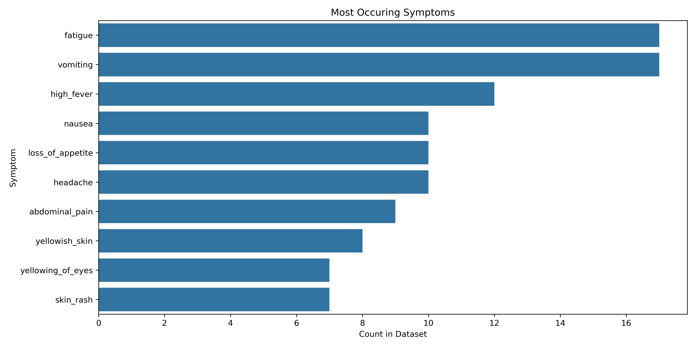
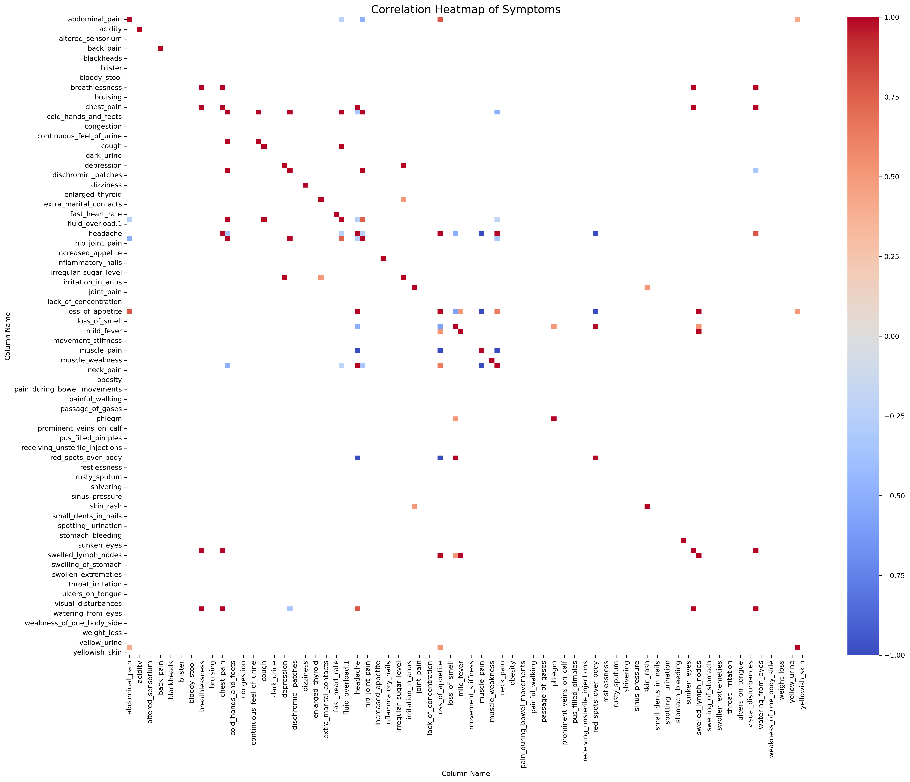
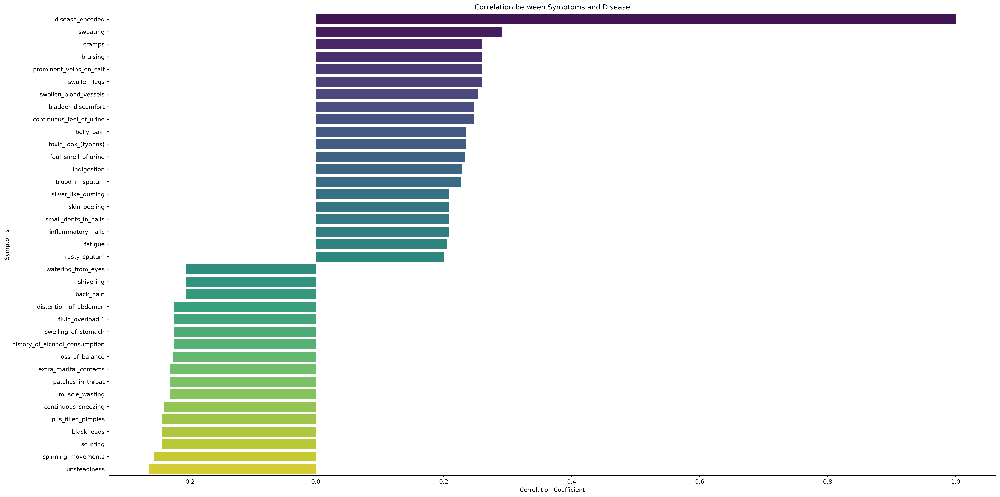

# Disease Prediction Using Machine Learning
## Table of Contents 
- Executive Summary 
- Problem Statement
- Project Goals 
- Methodology 
- Exploratory Analysis
    - Symptom Distribution 
    - Correlation
- Models
- Model Results 

## Executive Summary
This project serves as the final unit of the University of Toronto DSI Machine Learning Certificate Diploma. All contributors are visible within the repository. 

Our project leverages [this Kaggle dataset](https://www.kaggle.com/datasets/kaushil268/disease-prediction-using-machine-learning) to implement machine learning solutions aimed at clustering patients based on their symptoms, as well as determining symptoms that are the most important predictors for disease diagnosis.

## Problem Statement
Healthcare providers often struggle to quickly diagnose diseases due to a wide range of possible symptoms, as well as their variability accross patients. Traditional diagnosis methods are slow, error prone, and subject to human bias. This, in combination with the problems faced by Ontario's healthcare system indicates a need for systems capable of diagnosing patients based on the similarity and frequency of their symptoms. Such a system would assist medical professionals in client care, decrease misdiagnoses, and improve overall patient outcomes. 

## Project Goals
1. **Patient Clustering**: Train models to accurately determine client diagnosis by clustering based on symptom similarity.  
2. **Symptom Significance**: By examining the models created, we hope to determine the symptoms most indicative of a specific diagnosis. 
3. **Providing Actionable Insights**: Use the models to guide decision making, improve clinical workflows, and support evidence-based practices in patient care.

## Methodology
- Exploratory Analysis and Initial Visualization
- Model Selection and Feature Engineering 
- Model Assessment 

## Exploratory Analysis 
- **Predictor Variables:** A total of 131 predictors are present in the dataset. Each predictor represents a symptom reported by a client. Each row has a value of 1 (symptom is present) or 0 (symptom is absent). 

- **Target Variables:** This dataset has one target variable, labeled as `prognosis`. This represents the disease a client is diagnosed with. There are 41 possible diagnoses included in the dataset, all represented as text. 

- **Data Abnormalities:** As the dataset has been collected from Kaggle, there are no missing values present. We identified a column `fluid_overload` which contains only 0s as values. The proper column appears in the dataset as `fluid_overload1`, causing the removal of the former column. A final, empty column read as `Unnamed: 133` is included in the dataset and is deleted as well. 

- **Class Imbalances:** The dataset is evenly distributed, with all classes holding a distribution of 2.44% accross the dataset. 

- **Summary Statistics:** No summary statistics have been calculated for the dataset, as its binary format does not work with metrics like mean, median, and standard deviation. 

### Symptom Distribution
A goal of this study is to determine the most significant symptom that indicates the presence of a disease. To do so effectively, we explored the symptoms and their distributions prior to generating models. 

We found that clients diagnosed with the Common Cold reported more symptoms overall (17), followed closesly by Tuberculosis (16) Dengue (14) and Hepatitis E/Hyperthyroidism (13). 

We also decided to look at the symptoms that occurred the most accross diseases. Fatigue, Vomiting, High Fever, Loss of Appetite and Nausea make up the top 5 most occurring symptoms accross diseases. The top 10 most occurring are shown in the plot below: 

These observations provide us with insight on which symptoms might be most important to watch for, as well as which diseases our models might be biased towards when making predictions based on symptoms. 

### Correlation
Some group members intend to use logistic regression models to assess the data. These models assume that there should be little or no multicolinearity among independent levels. We conduct tests to identify if any predictors are strongly correlated with other predictors/diseases.

We also investigated the relationships between symtpom and disease. Significant correlations are plotted in the bar chart below, with a threshold set for 0.2. 

## Models

Each member of the group created a few models, then selected the best performing model of the group. We then compared our best performing models, and decided on a **Support Vector Classifier (SVC)** model as our top choice for this business case. The SVC model achieved an accuracy of 100% with balanced precision, recall, and F1 scores for both training and test datasets. The SVC model is capable of handling small datasets with high dimensional data effectively, making it an ideal choice for a clinical setting where clients can range from hundreds to thousands, with many potential predictors collected from symptoms and other individual traits. 

A potential disadvantage of SVCs is the high computational expense when interacting with larger datasets. If interpretability or scalability are an issue, our results show that Random Forests and XGBoost are suitable alternatives to the SVC. 

Below is a little more detail of the models created by the contributors 
### [Chetan]()
- Decision Tree, Random Forest, XGBoost and SVC Classifier models built. 
- All achieved a score of 1.0 on test set. 
- Decision Tree sleected as best performing model due to simplicity, ease of interpretation and computational efficiency.

### [Roha]()
- Neural Network, Random Forest, XGBoost, Decision Tree, SVC models built. 
- Accuracy scores ranging from 0.97 - 1.0 on test set. 
- SVC selected as best performing model due to perfect accuracy and balanced precision/recall/F1 scores. 

### [Frankline]()
- Random Forest, XGBoost, SVC models built. 
- All achieved a score of 1.0 on test set 
- Random Forest selected due to its simplicity, speed, and ease of interpretation. 

### [Justin]()
- Decision Tree, Logistic Regression, XGBoost models built. 
- Accuracy scores ranging from 0.87 - 1.0 on test set 
- Logistic Regression selected due to ease of implementation and accuracy. 

## Conclusion 
Using the skills gained from the University of Toronto DSI Program, we were able to train varoious models to accurately determine client diagnosis by clustering based on symptom similarity. Using SHAP analysis on some of the models created, we observed that the frequency of a symptom is not indicative of its significance in diagnosis. We also selected models that would be effective in a clinical setting (SVC), and have provided recommendations for models which would be better for large scale implementation. 

These modelling tools would be of great value to doctors and clinicians worldwide, as they allow for quick diagnosis with minimal effort involved. 
